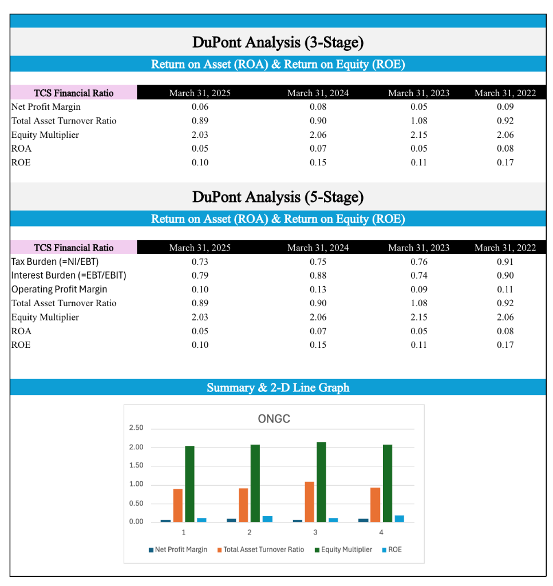
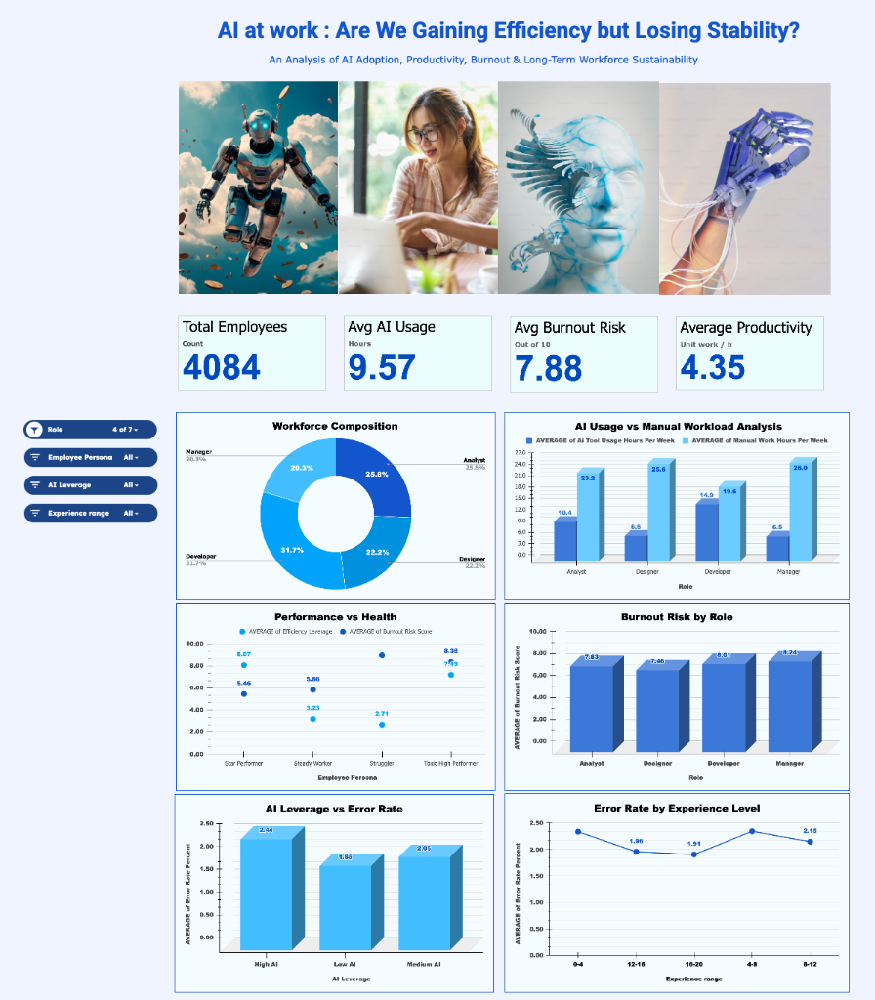

# Shreya Suman | Data Science Enthusiast & AI Analytics Builder

🌐 **Live Portfolio:** [shreya-portfolio.vercel.app](#) *(add your deployed link here)*

shreya.212suman@gmail.com | [GitHub](https://github.com/AlgoWitch) | [LinkedIn](https://www.linkedin.com/in/shreya-suman-5bb656328/)

---

## Summary

B.Tech CSE Student and Data Science enthusiast passionate about solving real-world problems using data, AI, and technology. I build impactful projects in analytics, machine learning, and user-focused digital products. Specializing in **Data Visualization & Analytics (DVA)**, turning complex datasets into clear, actionable intelligence.

---

## Technical Skills

**Data Visualization & Analytics:**
Tableau, Power BI, Excel, Google Sheets, Pandas, NumPy, Python, Data Analysis

**Programming & Development:**
Python, SQL, Git, GitHub, Machine Learning, Data Visualization

**Emerging Skills:**
AI & Machine Learning, Advanced Analytics

---

## Featured Projects

### [Global AQI Analytics Dashboard](https://public.tableau.com/app/profile/mausam.kumar8507/viz/Tableau_Dashboard_Final/DB-3Solutions?publish=yes)

- **Environmental Monitoring**: Advanced Tableau dashboard providing comprehensive visual insights into global Air Quality Index (AQI) trends and viable solutions.

### [Valuation Ratio Analysis](https://rishihoodeduin-my.sharepoint.com/:x:/g/personal/ash_2024_rishihood_edu_in/IQBbGoQPq5u0SLtJhKmqlhSQAcHgr4ppBbgscZXhsJnJb5o?e=wZgwOu)

- **Financial Modeling**: Comprehensive valuation ratio analysis for BEL and HAL, tracking metrics like Earnings Per Share, Price to Earnings, and Price to Sales ratios.

### [DuPont Analysis](https://rishihoodeduin-my.sharepoint.com/:x:/g/personal/ash_2024_rishihood_edu_in/IQAL6yxnUDqJQYb0YDBQXqfWAWRR0ethlFhi_n2mPbYjHZw?e=gOOFzF)

- **Corporate Finance Dashboard**: 3-Stage and 5-Stage DuPont Analysis focusing on Return on Asset (ROA) and Return on Equity (ROE) for organizations like TCS and ONGC.

### [AI at Work: Efficiency vs Stability](https://docs.google.com/spreadsheets/d/1hXWgkVV1PRSaZfl86P68GkNQflubBdjYmwfvNE2n8Pk/edit?gid=1369173376#gid=1369173376)

- **Workforce Analytics**: An interactive dashboard evaluating the impact of AI adoption across different roles, analyzing the balance between increased productivity and burnout risk.

---

## Soft Skills
Leadership, Research-Oriented, Critical Thinking, Problem-Solving, Cross-Functional Collaboration
